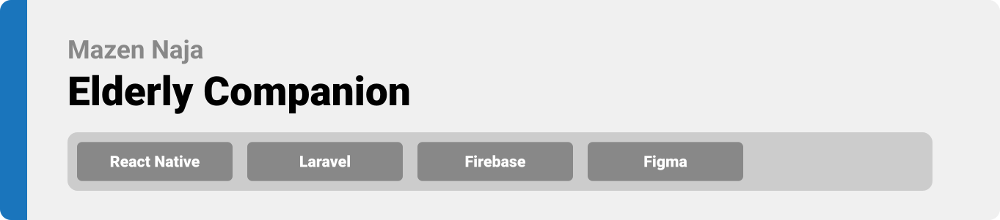

<div align="center">

> This project is  a mobile application developed to help the elderly to meet his daily essentials with the help of his caretakers. 


**[PROJECT PHILOSOPHY](https://github.com/julescript/well_app#-project-philosophy) • [WIREFRAMES](https://github.com/julescript/well_app#-wireframes) • [TECH STACK](https://github.com/julescript/well_app#-tech-stack) • [IMPLEMENTATION](https://github.com/julescript/well_app#-impplementation) • [HOW TO RUN?](https://github.com/julescript/well_app#-how-to-run)**

</div>

<br><br>


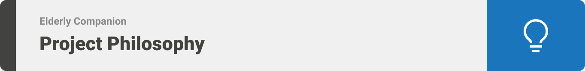

> The Elderly Companion app is an elderly and caretaker companion built to maintain the best organizer and communicator between the two.
> 
> There are 5 main features for the elderly and 4 for their caretakers. 
>
>Elderly:
>
>- Can check and add items to his schedule.
>- Can chat with his caretakers at any time.
>- Check and add medicines with how many times they should be taken.
>- Can check who his caretakers are with the ability to add or remove them.
>- Get Notifications whenever a scheduled item is near.
>
>Caretaker:
>
>- Can check his Elders schedules.
>- Can add or remove Elders.
>- Can communicate with his Elders anytime.
>- Receive Notifications whenever his Elder has scheduled item near.
<br><br>


### User Stories
- As an elder, I want to find what I need easily, so that I can navigate into my required desire without any confusion.
- As an Elder, I want to check my schedule, so that I can know what I have today.
- As an Elder, I want to communicate with my caretakers, so that I can tell them what I need.
- As a caretaker, I want to check my elders schedule, so that I can help them and make sure they have their task done properly.
- As a caretaker, I want to communicate with my elder, so that I can make sure that he is doing well.

<br><br>

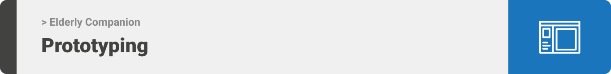

> This design was planned before on Wireframes, then moved to Figma app for the fine mockup details.
Note that i didn't use any styling library or theme, all from scratch and using pure css modules.

| Role  | Log in |
| -----------------| -----|
| 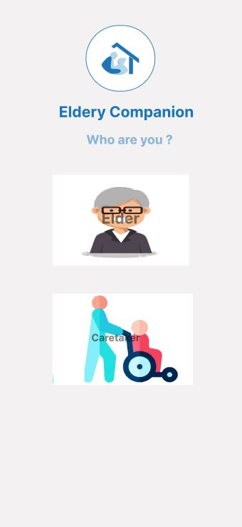 | 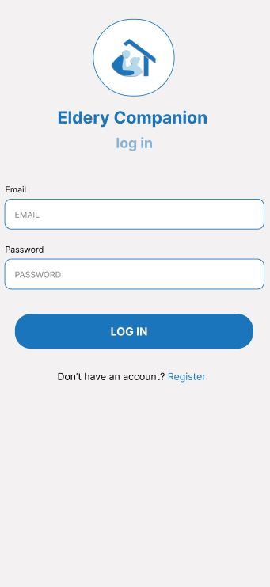 |


| Sign up  | Caretaker's Homepage  |
| -----------------| -----|
| 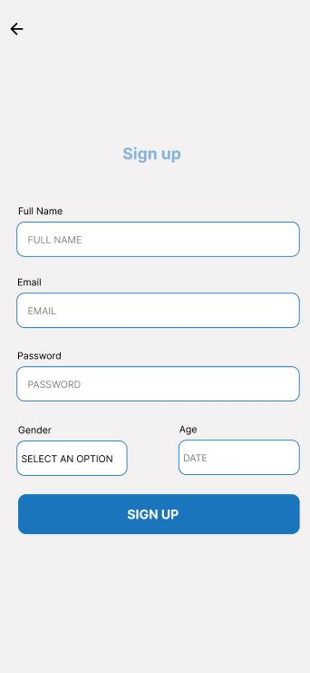| 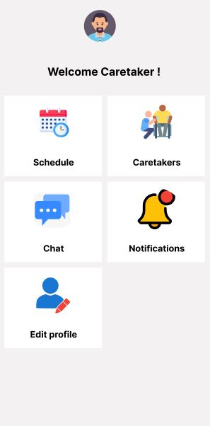 


| Elder's Caretakers | Caretaker's Elders  |
| -----------------| -----|
| 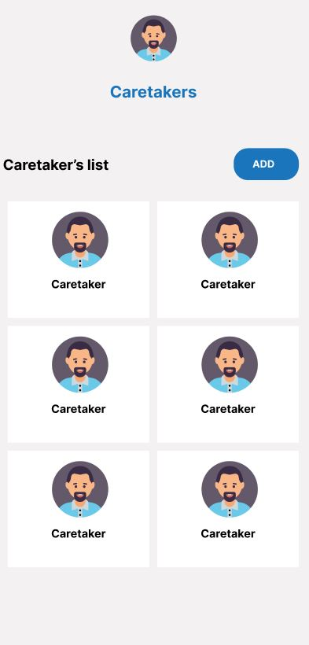 | 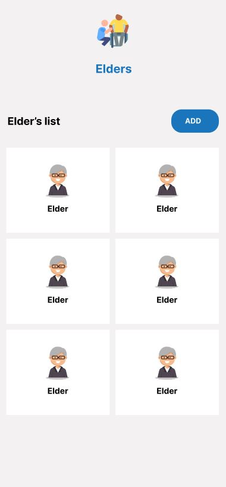 


| Chat | Notifications  |
| -----------------| -----|
| 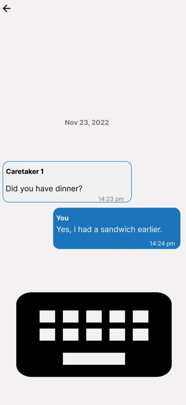| 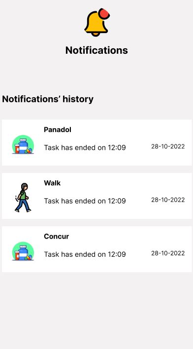 

<br><br>

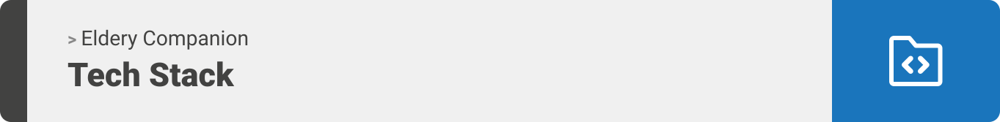

Here's a brief high-level overview of the tech stack the Well app uses:

- This project uses the [React Native developement framework](https://https://reactnative.dev/). React Native combines the best parts of native development with React, a best-in-class JavaScript library for building user interfaces.
- For the backend, this app uses [Laravel](https://laravel.com/) that provides all of the features , such as routing, validation, caching, queues, file storage, and more.
- For persistent storage (database), the app uses [Laravel](https://laravel.com/) which allows the app to create a custom storage schema and save it to a local database.
- To send push notifications, the app uses [firebase](https://firebase.google.com/) notifications package which supports Android and iOS.


<br><br>
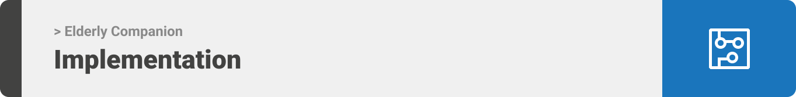

> Using the above mentioned tech stacks and the mockups build with figma from the user sotries we have, the implementation of the app is shown as below, these are screenshots from the real app

| Role  | Login  |
| -----------------| -----|
| 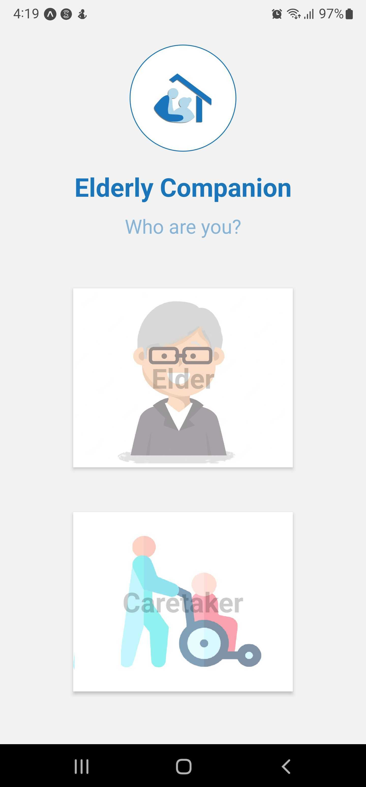 | 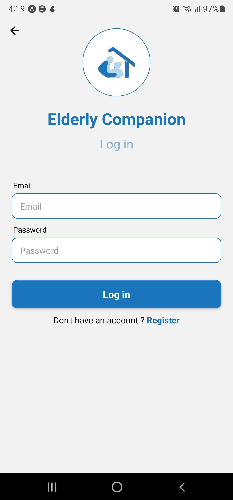 |


| Sign up  | Elder Homepage  |
| -----------------| -----|
 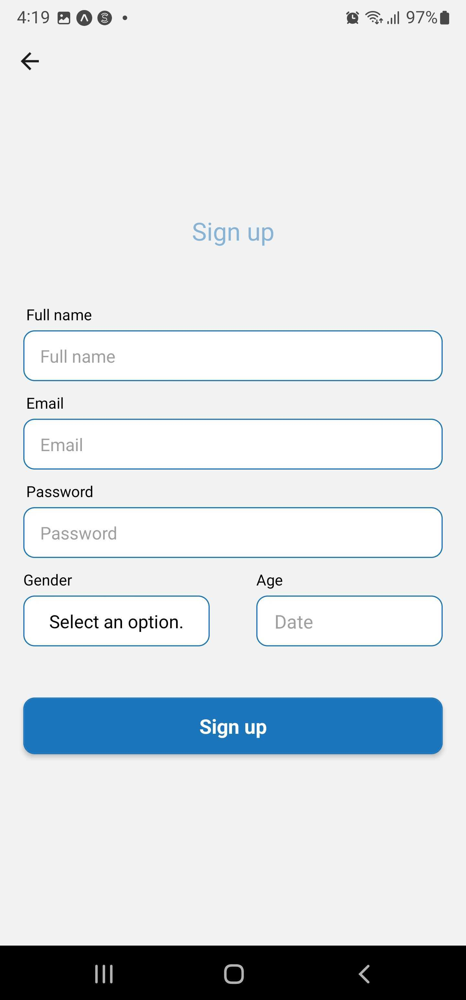 |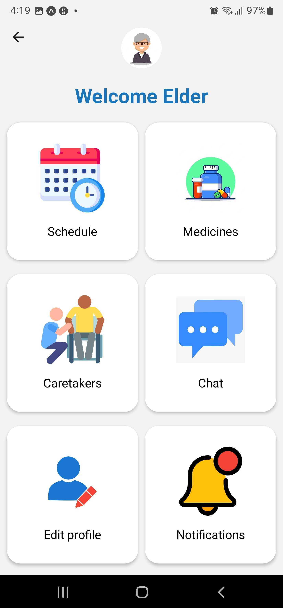 

| Caretaker's Homepage  | Schedule  |
| -----------------| -----|
|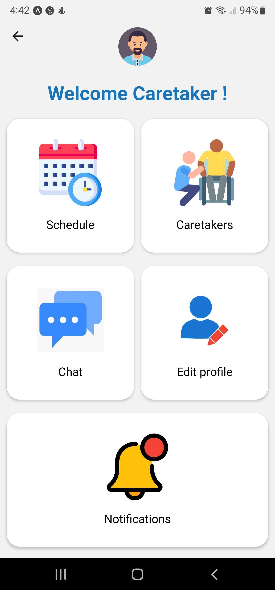 | 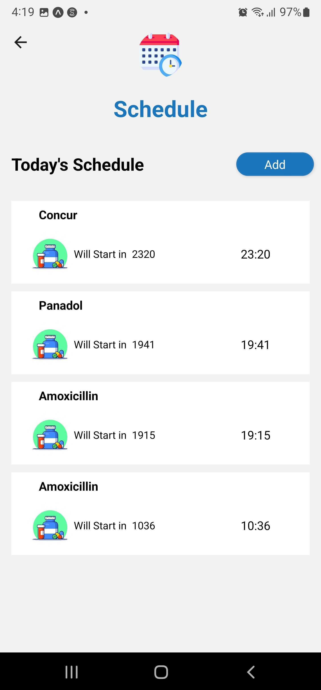 |

| Medicines  | Chat  |
| -----------------| -----|
| 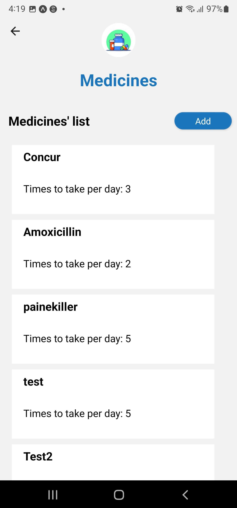 | 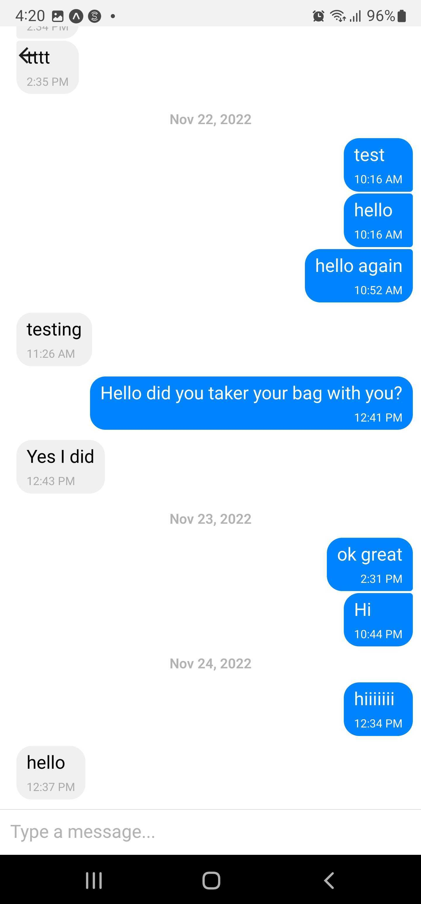 |


| Notifications  | 
| -----------------|
| 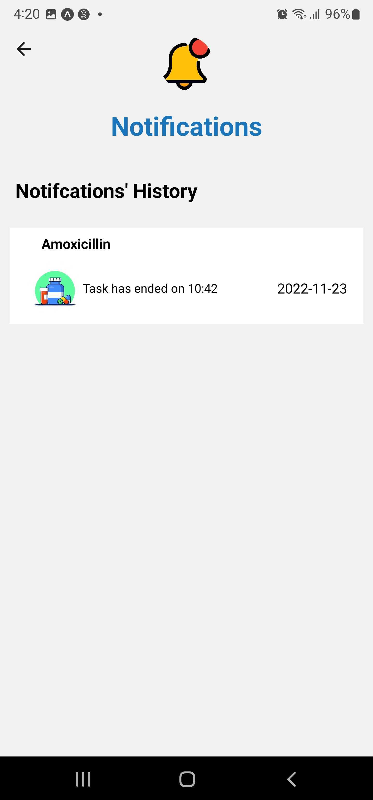 | !
<br><br>


>To run the project, open cmd and navigate to the project's directory.

### Prerequisites

Make sure that you have the packages installed below along with NodeJs to continue.
* Go to [NodeJs](https://nodejs.org/en/) and click on download the LTS version. After that open the downloaded installer and follow the instructions on the screen. A restart maybe required if npm does not work in the cmd.
* npm
  ```sh
  npm install npm@latest -g
  ```
* Make sure that you have composer installed on your computer for laravel. To install it, go to [Composer](https://getcomposer.org/download/) and follow the instructions on the screen.
### Installation

_Below is an example of how you can instruct your audience on installing and setting up your app. This template doesn't rely on any external dependencies or services._


1. Clone the repo
   ```sh
   git clone https://github.com/mazen-naja/elderly_companion.git
   ```
2. Navigate to the front_end folder and run the below in cmd
   ```sh
   npm start
   ```
3. Install expo go on your phone and scan the barcode that appeared in the cmd. Make sure that your phone and computer are connected to the same network

4. In another cmd, navigate to the server folder in the backend and run the command
   ```sh
   php artisan serve
   ```

